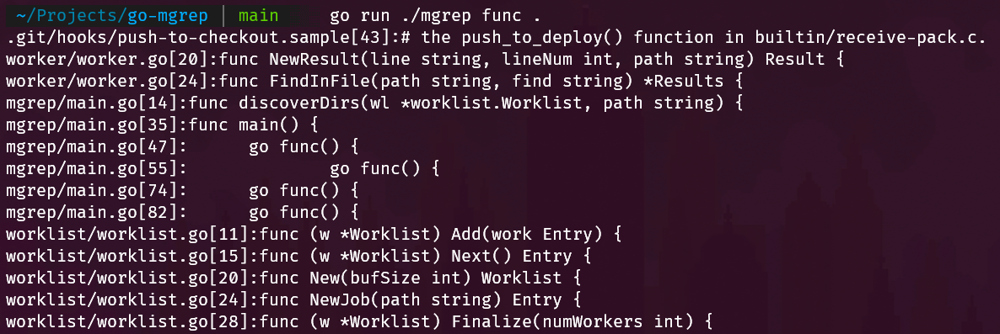

# go-mgrep

## Summary:

Multithreaded grep clone that can do simple substring searching within files.

### Features

- Auto-recurses into subdirectories and uses goroutines to search through the files for a substring match
- Displays matches to the terminal as they are found
- Displays the line number, file path, and complete line containing the match

Syntax: `go run ./mgrep search_string search_dir`

> This is an example of the output when using `func` as the search_string at the root of this directory
